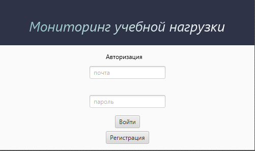
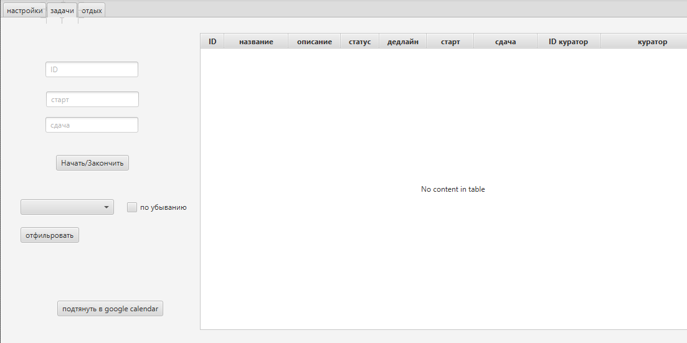
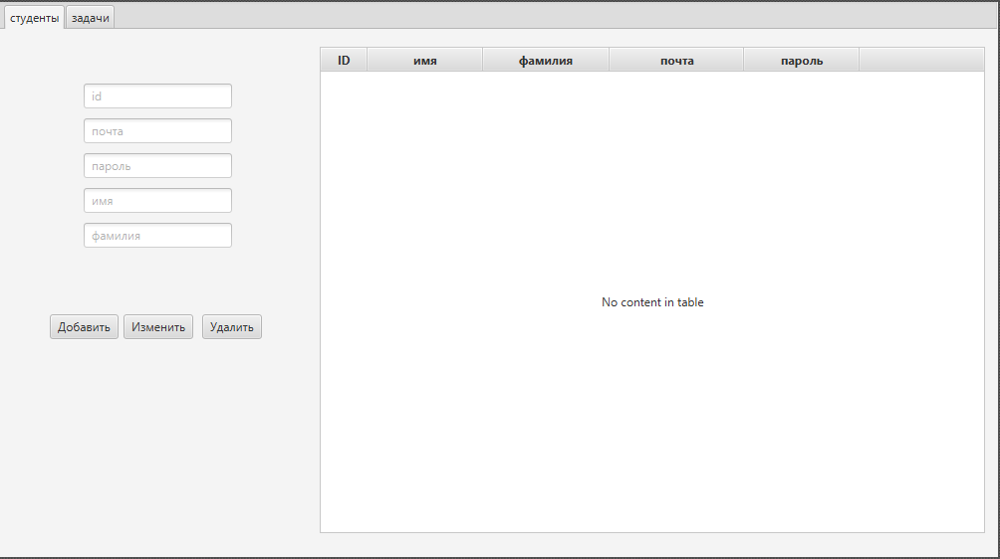
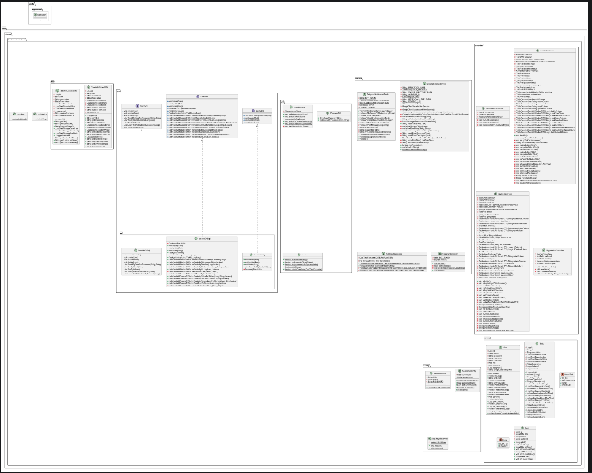
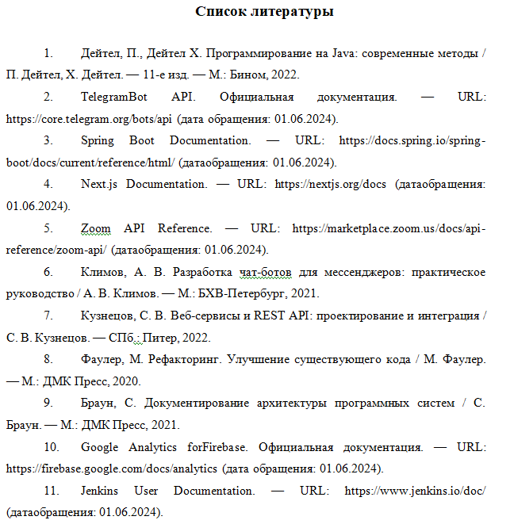

# Система мониторинга учебной нагрузки

## Предметная область: 

Контроль баланса учебы/отдыха.

## Функциональные требования:

1. CRUD: Учет задач, дедлайнов, времени сна.
2. Фильтрация: Анализ перегрузок по неделям.
3. Временные параметры: Рекомендации по тайм-менеджменту.
4. Сервис 1: Интеграция с Google Calendar.
5. Сервис 2: Генерация отчетов (Service2 → DAO → PDF).
6. Сервис 3: Умные оповещения (Telegram API).

## Архитектура проекта

## 1. Зависимости

### Язык программирования и окружение
- **Java 21**
- **JavaFX 21**
- **JUnit 5**
- **Mockito**

### Библиотеки
- **Jackson** для работы с JSON
- **Maven** для управления зависимостями
- **Google Api Calendar** для интеграции google calendar

### Инструменты
- **IntelliJ IDEA Ultimate**
- **Scene Builder**

## 2. Установка

### Требования:
- Установленная **Java 21**
- Maven 

### Шаги установки:
1. клонировать репозиторий
2. docker-compose up -d

## 3. Конфигурация

### Хранение данных
Данные хранятся в бд PostgreSql образа docker

### Интерфейс
- Стили: встроенные в JavaFX

## 4. Функциональность

### Основные возможности:
1. Регистрация куратора / студента
2. Аутентификация пользователей
3. Управление профилем 
4. Просмотр истории 
5. Валидация данных

### Валидация данных:
- Проверка формата email
- Проверка обязательных полей

## 5. Тестирование

### Unit-тесты:
- Тестирование сервисов 
- Проверка валидации данных
- Тестирование аутентификации
- Проверка CRUD операций

### Технологии тестирования:
- JUnit 5
- Mockito для мокирования
- Тестирование JavaFX компонентов

## 6. Безопасность

### Меры безопасности:
- Хранение паролей в зашифрованном виде
- Валидация всех вводимых данных
- Защита от SQL-инъекций
- Безопасное хранение данных 

## 7. Диаграмма классов

## 8. Литературные источники

